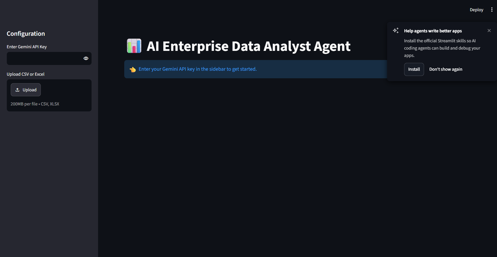

# AI Data Analyst Agent

An AI-powered Data Analyst Agent that allows users to upload CSV and Excel files and analyze their data using natural language questions.

## Features

* Upload CSV and Excel datasets
* Ask questions about data using natural language
* AI-assisted data analysis
* Data filtering and aggregation
* Data visualization
* AI-generated insights and summaries
* Simple Streamlit interface

## Tech Stack

* Python
* Streamlit
* Google Gemini API
* Pandas
* Matplotlib
* Seaborn
* OpenPyXL

## How It Works

1. Upload a CSV or Excel dataset.
2. The application reads the dataset.
3. Ask a question about the data.
4. Gemini helps interpret the question.
5. Pandas processes the data.
6. The application displays the result and visualizations.
7. AI-generated insights explain the findings.

## Application Preview



## Installation

### 1. Clone the repository

```bash
git clone https://github.com/potnurunikitha1406/ai-data-analyst-agent.git
```

### 2. Go to the project folder

```bash
cd ai-data-analyst-agent
```

### 3. Create a virtual environment

```bash
python -m venv venv
```

### 4. Activate the virtual environment on Windows

```bash
venv\Scripts\activate
```

### 5. Install the required packages

```bash
pip install -r requirements.txt
```

## API Key

This project uses the Google Gemini API.

Enter your Gemini API key through the application.

**Never upload your API key to GitHub.**

## Run the Application

```bash
streamlit run app.py
```

Then open:

```text
http://localhost:8501
```

## Future Improvements

* Advanced data cleaning
* Automated dashboard generation
* More visualization options
* Conversational analysis history
* Exportable analytical reports

## Author

**Nikitha Potnuru**

B.Tech – Computer Science and Engineering (Artificial Intelligence and Machine Learning)
